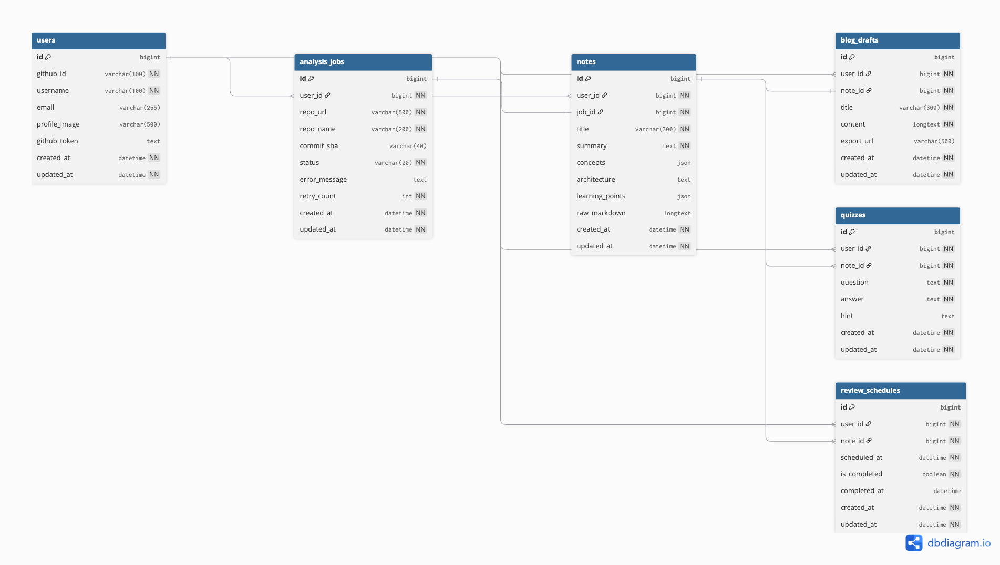

# ERD 설계

> v1.0 | 2026.03

---

## 1. ERD 개요

MVP 범위 기준 테이블 구성입니다.
- PK: Auto Increment (BIGINT)
- 공통 컬럼: `created_at` / `updated_at`

### 테이블 목록

| 테이블명 | 구분 | 설명 |
|----------|------|------|
| `users` | MVP | GitHub OAuth 로그인 사용자 정보 |
| `analysis_jobs` | MVP | AI 분석 요청 Job 상태 관리 |
| `notes` | MVP | AI 생성 학습 노트 (구조화 JSON) |
| `blog_drafts` | MVP | 노트 기반 블로그 초안 (1:1) |
| `quizzes` | 2차 | 학습 노트 기반 퀴즈 문제 |
| `review_schedules` | 2차 | 복습 알림 일정 관리 |

### 테이블 관계

| 테이블 A | 관계 | 테이블 B | 설명 |
|----------|------|----------|------|
| `users` | 1 : N | `analysis_jobs` | 한 사용자가 여러 분석 Job 요청 가능 |
| `analysis_jobs` | 1 : 1 | `notes` | 하나의 Job은 하나의 노트를 생성 |
| `notes` | 1 : 1 | `blog_drafts` | 노트 하나에 블로그 초안 하나 |
| `notes` | 1 : N | `quizzes` | (2차) 노트에서 여러 퀴즈 생성 |
| `notes` | 1 : N | `review_schedules` | (2차) 노트에서 복습 일정 생성 |

---

## 2. 테이블 상세 정의

### users

GitHub OAuth2 로그인 사용자 정보를 저장합니다.

| 컬럼명 | 타입 | NULL | PK | FK | 설명 |
|--------|------|------|----|----|------|
| `id` | BIGINT | X | ✓ | | PK, Auto Increment |
| `github_id` | VARCHAR(100) | X | | | GitHub 사용자 고유 ID (unique) |
| `username` | VARCHAR(100) | X | | | GitHub 로그인 username |
| `email` | VARCHAR(255) | O | | | GitHub 이메일 (공개 시 저장) |
| `profile_image` | VARCHAR(500) | O | | | GitHub 프로필 이미지 URL |
| `github_token` | TEXT | O | | | GitHub access token (AES-256 암호화 저장) |
| `created_at` | DATETIME | X | | | 생성일시 |
| `updated_at` | DATETIME | X | | | 수정일시 |

> ⚠️ `github_token`은 암호화(AES-256) 후 저장 권장

---

### analysis_jobs

GitHub repo 분석 요청 Job의 상태를 관리합니다.

| 컬럼명 | 타입 | NULL | PK | FK | 설명 |
|--------|------|------|----|----|------|
| `id` | BIGINT | X | ✓ | | PK, Auto Increment |
| `user_id` | BIGINT | X | | ✓ | FK → users.id |
| `repo_url` | VARCHAR(500) | X | | | 분석 대상 GitHub repo URL |
| `repo_name` | VARCHAR(200) | X | | | repo 이름 (owner/repo) |
| `commit_sha` | VARCHAR(40) | O | | | 분석 시점 last commit SHA (캐싱 키) |
| `status` | VARCHAR(20) | X | | | PENDING \| PROCESSING \| COMPLETED \| FAILED |
| `error_message` | TEXT | O | | | 실패 시 에러 메시지 |
| `retry_count` | INT | X | | | 재시도 횟수 (default: 0) |
| `created_at` | DATETIME | X | | | 생성일시 (요청 시각) |
| `updated_at` | DATETIME | X | | | 수정일시 (상태 변경 시각) |

> status 값: `PENDING`(대기) → `PROCESSING`(분석 중) → `COMPLETED`(완료) / `FAILED`(실패)

---

### notes

AI가 생성한 학습 노트를 구조화된 JSON으로 저장합니다.

| 컬럼명 | 타입 | NULL | PK | FK | 설명 |
|--------|------|------|----|----|------|
| `id` | BIGINT | X | ✓ | | PK, Auto Increment |
| `user_id` | BIGINT | X | | ✓ | FK → users.id |
| `job_id` | BIGINT | X | | ✓ | FK → analysis_jobs.id (unique) |
| `title` | VARCHAR(300) | X | | | 노트 제목 (repo명 기반 자동 생성) |
| `summary` | TEXT | X | | | 프로젝트 요약 (1~3문장) |
| `concepts` | JSON | O | | | 핵심 개념 키워드 목록 (JSON Array) |
| `architecture` | TEXT | O | | | 주요 구조 설명 (Markdown) |
| `learning_points` | JSON | O | | | 학습 포인트 목록 (JSON Array) |
| `raw_markdown` | LONGTEXT | O | | | 전체 노트 Markdown 렌더링용 원문 |
| `created_at` | DATETIME | X | | | 생성일시 |
| `updated_at` | DATETIME | X | | | 수정일시 |

> 💡 `concepts`, `learning_points`는 PostgreSQL JSONB 타입 사용 시 GIN 인덱스로 검색 기능 확장 가능

---

### blog_drafts

학습 노트 기반으로 생성된 블로그 초안을 저장합니다. notes와 1:1 관계입니다.

| 컬럼명 | 타입 | NULL | PK | FK | 설명 |
|--------|------|------|----|----|------|
| `id` | BIGINT | X | ✓ | | PK, Auto Increment |
| `user_id` | BIGINT | X | | ✓ | FK → users.id |
| `note_id` | BIGINT | X | | ✓ | FK → notes.id (unique) |
| `title` | VARCHAR(300) | X | | | 블로그 포스트 제목 |
| `content` | LONGTEXT | X | | | 블로그 본문 (Markdown) |
| `export_url` | VARCHAR(500) | O | | | S3 export 파일 URL (.md) |
| `created_at` | DATETIME | X | | | 생성일시 |
| `updated_at` | DATETIME | X | | | 수정일시 |

---

### quizzes (2차)

학습 노트 기반으로 생성된 퀴즈 문제를 저장합니다.

| 컬럼명 | 타입 | NULL | PK | FK | 설명 |
|--------|------|------|----|----|------|
| `id` | BIGINT | X | ✓ | | PK, Auto Increment |
| `user_id` | BIGINT | X | | ✓ | FK → users.id |
| `note_id` | BIGINT | X | | ✓ | FK → notes.id |
| `question` | TEXT | X | | | 퀴즈 문제 |
| `answer` | TEXT | X | | | 정답 |
| `hint` | TEXT | O | | | 힌트 (선택) |
| `created_at` | DATETIME | X | | | 생성일시 |
| `updated_at` | DATETIME | X | | | 수정일시 |

---

### review_schedules (2차)

학습 노트 기반 복습 일정을 저장합니다.

| 컬럼명 | 타입 | NULL | PK | FK | 설명 |
|--------|------|------|----|----|------|
| `id` | BIGINT | X | ✓ | | PK, Auto Increment |
| `user_id` | BIGINT | X | | ✓ | FK → users.id |
| `note_id` | BIGINT | X | | ✓ | FK → notes.id |
| `scheduled_at` | DATETIME | X | | | 복습 예정 일시 |
| `is_completed` | BOOLEAN | X | | | 복습 완료 여부 (default: false) |
| `completed_at` | DATETIME | O | | | 복습 완료 일시 |
| `created_at` | DATETIME | X | | | 생성일시 |
| `updated_at` | DATETIME | X | | | 수정일시 |

---

## 3. 인덱스 전략

| 테이블 | 인덱스 컬럼 | 목적 |
|--------|-------------|------|
| `users` | `github_id` (unique) | OAuth 로그인 시 중복 가입 방지 및 빠른 조회 |
| `analysis_jobs` | `user_id` | 사용자별 Job 목록 조회 |
| `analysis_jobs` | `status` | 상태별 Job 필터링 |
| `analysis_jobs` | `(repo_url, commit_sha)` | 동일 repo 캐싱 여부 확인 |
| `notes` | `user_id` | 사용자별 노트 목록 조회 |
| `notes` | `job_id` (unique) | Job-노트 1:1 관계 보장 |
| `blog_drafts` | `note_id` (unique) | 노트-블로그 1:1 관계 보장 |

---

## 4. 주요 설계 결정 사항

**PK 전략: Auto Increment BIGINT**
- 심플한 구조, 단일 서버 MVP에 적합
- 분산 환경 전환 시 UUID로 마이그레이션 고려

**JSON 컬럼 활용 (concepts, learning_points)**
- AI 응답 구조가 배열 형태로 유연하게 변경될 수 있어 JSON 타입 적용
- PostgreSQL JSONB 사용 시 GIN 인덱스로 검색 기능 확장 가능

**github_token 보안**
- GitHub access_token은 DB 저장 시 AES-256 암호화 적용 권장
- Redis에 단기 캐싱 후 TTL 만료로 자동 삭제하는 방식도 고려 가능

**analysis_jobs의 commit_sha 캐싱 전략**
- 동일 repo + 동일 commit SHA 요청 시 AI 재호출 없이 기존 노트 반환
- 새 커밋 push 후 요청 시 새 Job 생성 → 최신 분석 결과 제공

---

## 5. ERD 다이어그램

